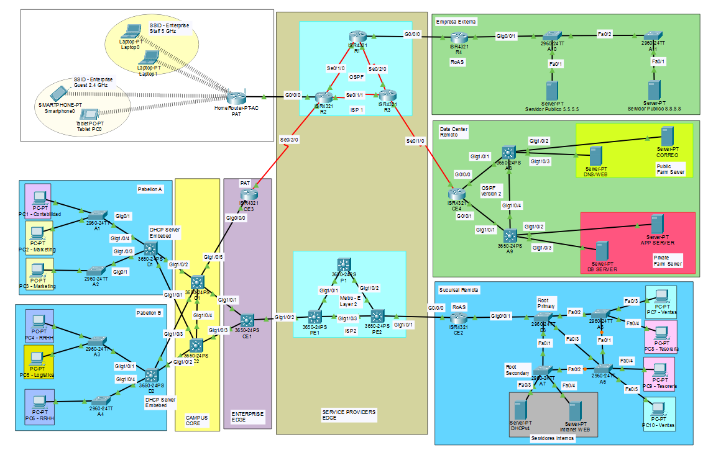
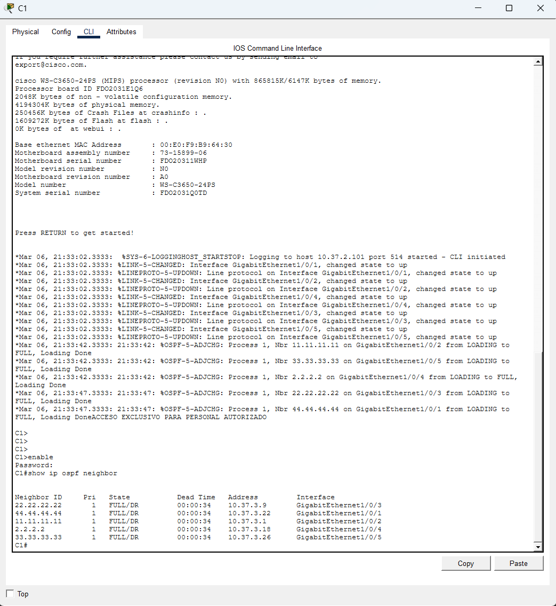
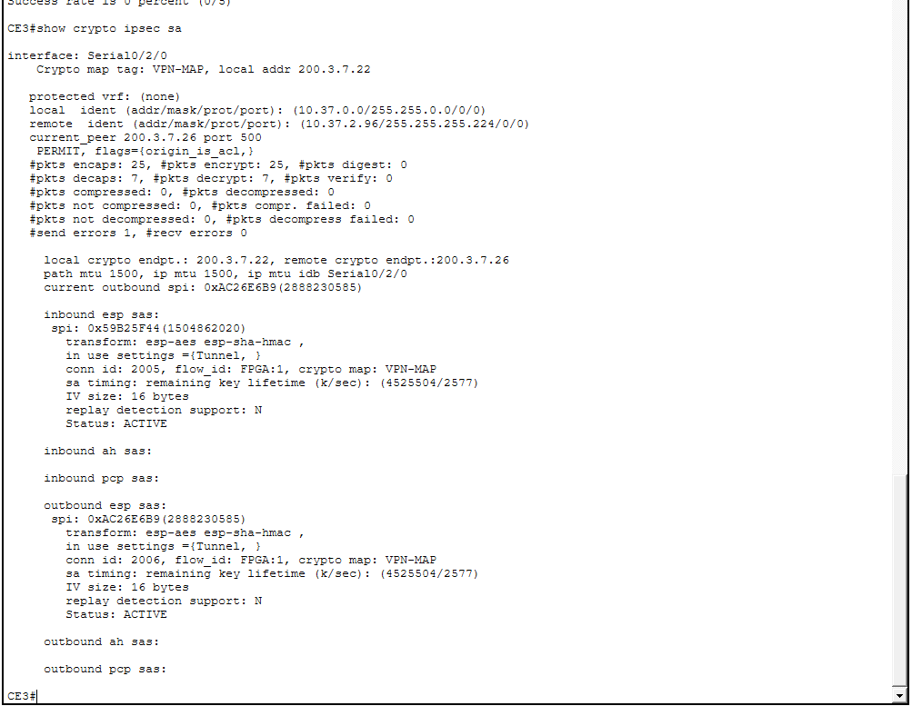
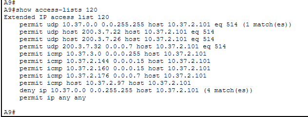
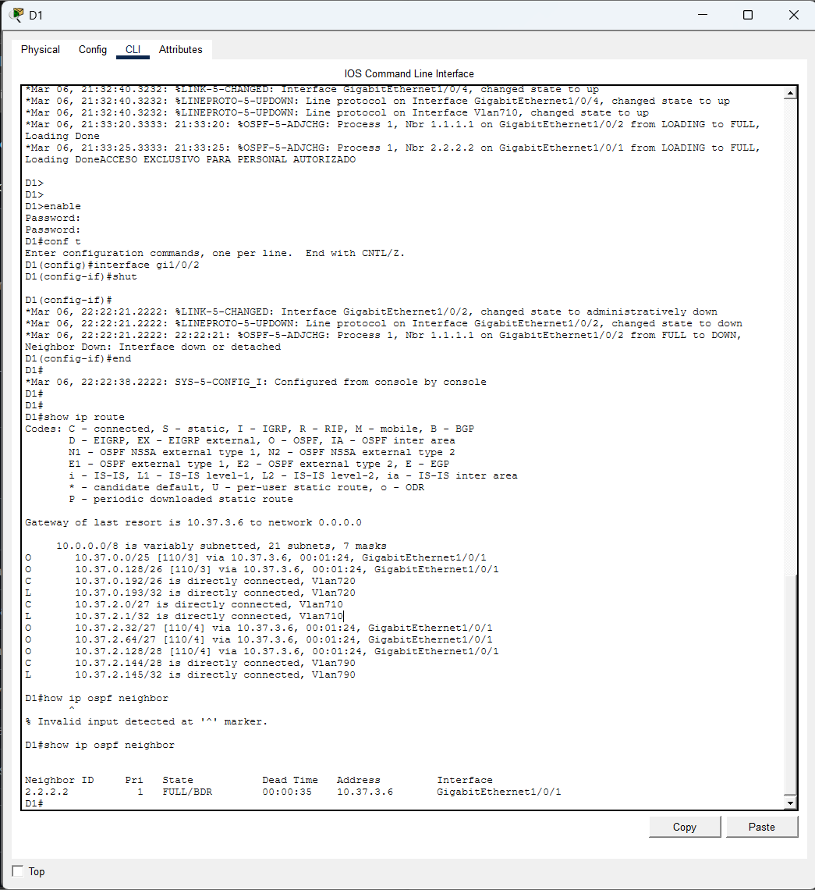
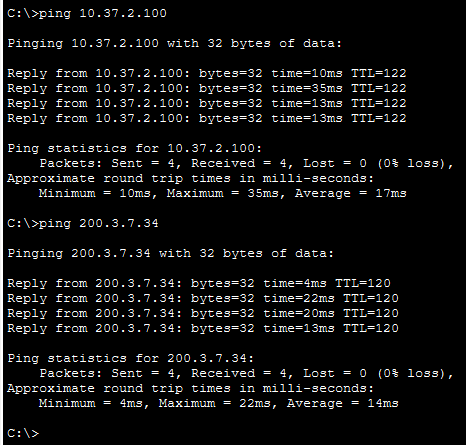

# Enterprise Campus Network Design

Proyecto personal de diseño e implementación de una infraestructura
de red empresarial multisede desarrollada en Cisco Packet Tracer.

## Descripción del proyecto

Este proyecto consiste en el diseño e implementación de una infraestructura de red empresarial multisede. La solución integra una sede principal, una sucursal remota, un centro de datos, proveedores de servicios, una oficina SOHO y una empresa externa simulada.

La red fue diseñada para proporcionar segmentación, conectividad, seguridad, administración remota y continuidad de los servicios frente a la caída de enlaces.

## Arquitectura de la red

La topología fue diseñada con una arquitectura empresarial multisede, separando la infraestructura en diferentes bloques funcionales para facilitar la administración, escalabilidad y redundancia.

La solución está compuesta por:

- Sede principal, con switches de acceso, distribución y núcleo.
- Áreas de usuarios para Contabilidad, Marketing, Recursos Humanos y Logística.
- Sucursal remota, con las áreas de Ventas, Tesorería y servidores internos.
- Centro de datos remoto, dividido entre servidores públicos y servidores privados.
- Red Metro Ethernet, utilizada para conectar la sede principal con la sucursal remota.
- ISP redundante, compuesto por tres routers interconectados mediante OSPF.
- Oficina SOHO, con conectividad cableada e inalámbrica.
- Empresa externa simulada, utilizada para validar conectividad hacia servicios externos.

### Topología implementada

La siguiente imagen muestra la arquitectura general implementada en Cisco Packet Tracer:

La infraestructura utiliza enlaces redundantes en diferentes segmentos de la red con el objetivo de mantener la conectividad ante la caída de enlaces principales.

## Tecnologías implementadas

- IPv4 y VLSM.
- VLAN y enlaces trunk IEEE 802.1Q.
- Enrutamiento inter-VLAN.
- OSPFv2.
- Rapid Spanning Tree Protocol.
- DHCP.
- DNS.
- HTTP.
- Correo electrónico.
- NAT y PAT.
- VPN IPsec site-to-site.
- Listas de control de acceso.
- SSH.
- Port-security.
- PortFast y BPDU Guard.
- SYSLOG.

## Plan de direccionamiento

La infraestructura empresarial utiliza el bloque privado:

`10.37.0.0/16`

Para simular las redes públicas se utilizó:

`200.3.7.0/16`

El direccionamiento fue dividido mediante VLSM según la cantidad de usuarios, servidores y enlaces punto a punto requeridos.

## Enrutamiento y redundancia

Se implementó OSPF para el intercambio dinámico de rutas entre los dispositivos de capa 3.

La solución incluye:

- Redundancia entre distribución y núcleo.
- Conexión redundante de CE1 hacia C1 y C2.
- Triángulo redundante en ISP1.
- Redundancia en la red Metro Ethernet.
- Caminos alternativos en el centro de datos.
- Reconvergencia automática ante la caída de enlaces.

## VPN IPsec

Se implementó una VPN IPsec site-to-site entre CE3 y CE4 para proteger la comunicación entre la red corporativa y los servidores privados del centro de datos.

La VPN fue validada mediante:

- Estado ISAKMP `QM_IDLE`.
- Contadores de encapsulación y desencapsulación.
- Pruebas de conectividad bidireccional.
- Acceso al servidor de aplicaciones mediante el túnel.

## Seguridad implementada

- Administración remota mediante SSH.
- Port-security con aprendizaje de direcciones MAC sticky.
- Puertos no utilizados asignados a la VLAN 799 y apagados.
- PortFast y BPDU Guard en puertos de usuario.
- ACL extendida para proteger el servidor de base de datos.
- Segmentación entre usuarios, servidores y administración.
- NAT exemption para el tráfico de la VPN.

## Servicios de red

Se configuraron y validaron los siguientes servicios:

- Asignación automática de direcciones mediante DHCP.
- Resolución de nombres mediante DNS.
- Sitio web público.
- Intranet corporativa.
- Servidor de aplicaciones privado.
- Servicio de correo electrónico.
- Registro de eventos mediante SYSLOG.

## Pruebas realizadas

Durante la implementación se realizaron pruebas de conectividad, enrutamiento, seguridad, servicios y redundancia para validar el correcto funcionamiento de la infraestructura.

Entre las principales pruebas realizadas se encuentran:

- Comunicación entre VLAN.
- Acceso a servicios internos y externos.
- Resolución de nombres DNS.
- Envío y recepción de correo.
- Acceso al servidor de aplicaciones mediante la VPN.
- Bloqueo del acceso de usuarios al servidor de base de datos.
- Reconvergencia de OSPF.
- Caída de enlaces del campus.
- Caída de enlaces de ISP1.
- Redundancia de Metro Ethernet.
- Redundancia del centro de datos.
- Validación de RSTP y port-security.
- Acceso remoto mediante SSH.

### Evidencias

#### OSPF y enrutamiento dinámico

Se verificó la formación correcta de adyacencias OSPF entre los dispositivos de capa 3, comprobando que los vecinos se encuentren en estado FULL.

#### VPN IPsec site-to-site

Se validó el establecimiento del túnel VPN IPsec entre CE3 y CE4 mediante el estado QM_IDLE, además de pruebas de conectividad entre la red corporativa y los servidores privados del centro de datos.

#### Seguridad mediante ACL

Se implementó una ACL extendida para restringir el acceso de los usuarios al DB Server 10.37.2.101, permitiendo únicamente el tráfico autorizado.

#### Redundancia y reconvergencia

Se realizaron pruebas de falla de enlaces para comprobar que OSPF reconverja automáticamente y mantenga la conectividad mediante caminos alternativos.

La conectividad se mantuvo durante la caída del enlace, validando el funcionamiento del camino redundante.

## Resultados

Las pruebas realizadas confirmaron la conectividad entre las diferentes áreas de la empresa, la disponibilidad de los servicios, la reconvergencia ante la caída de enlaces y la correcta aplicación de los controles de seguridad.

## Herramientas utilizadas

- Cisco Packet Tracer.
- Cisco IOS.
- Microsoft Excel.
- GitHub.

## Archivos del proyecto

- Topología de Cisco Packet Tracer.
  
  
  
- Plan de direccionamiento IP.

  
  
- Capturas de las pruebas realizadas.

  

- Configuraciones principales de routers y switches.
- Informe técnico del proyecto.

## Nota de seguridad

Las credenciales incluidas en la simulación son exclusivamente de laboratorio y no corresponden a cuentas, equipos o sistemas reales.

## Autor

**Cristian Piero Rosales Cuicapuza**  
Estudiante de Ingeniería de las Telecomunicaciones  
Pontificia Universidad Católica del Perú
